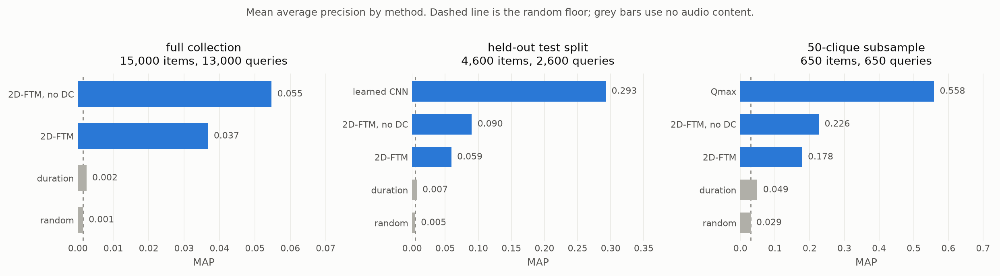
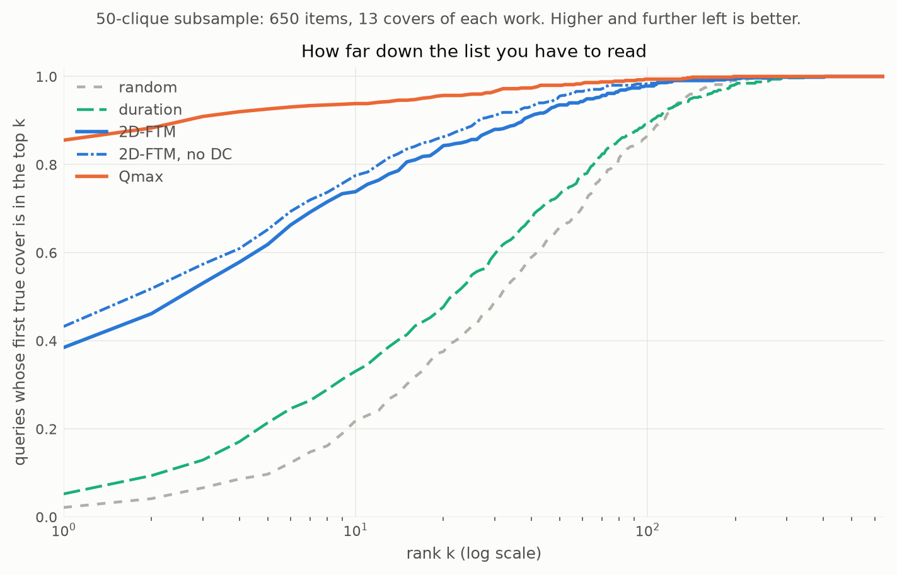
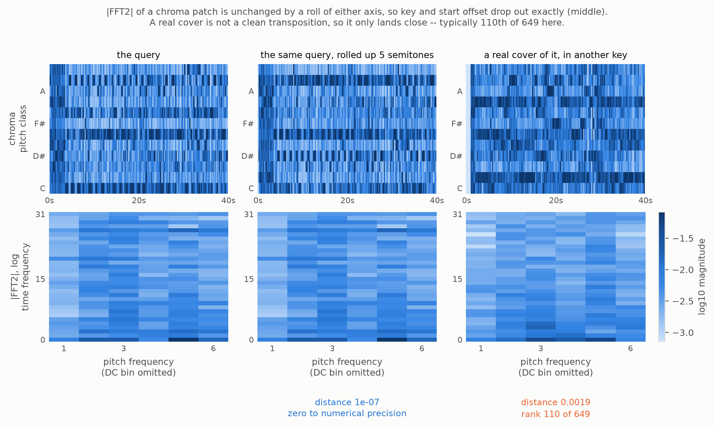
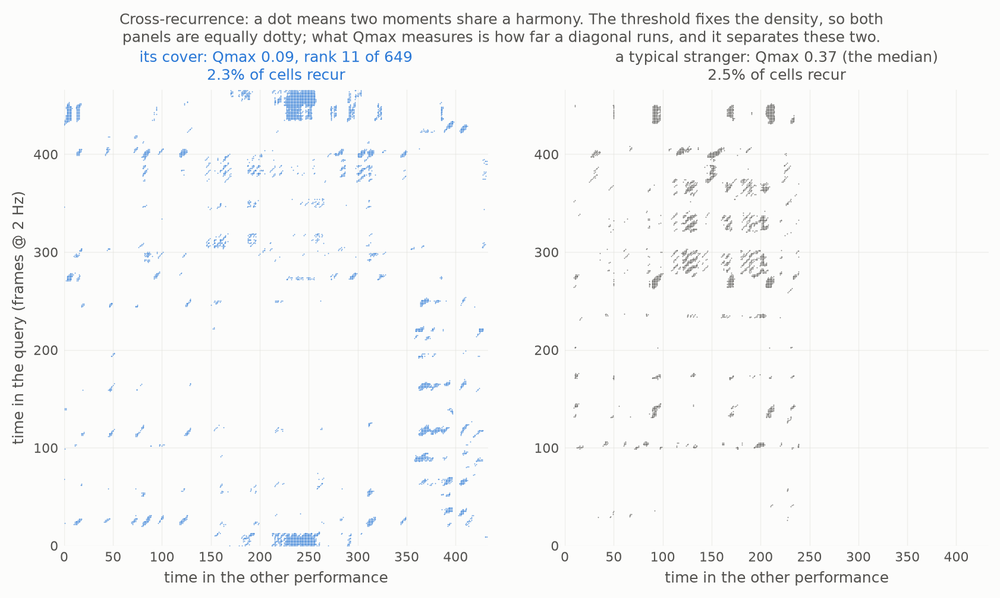
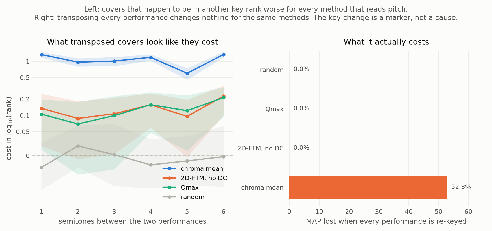
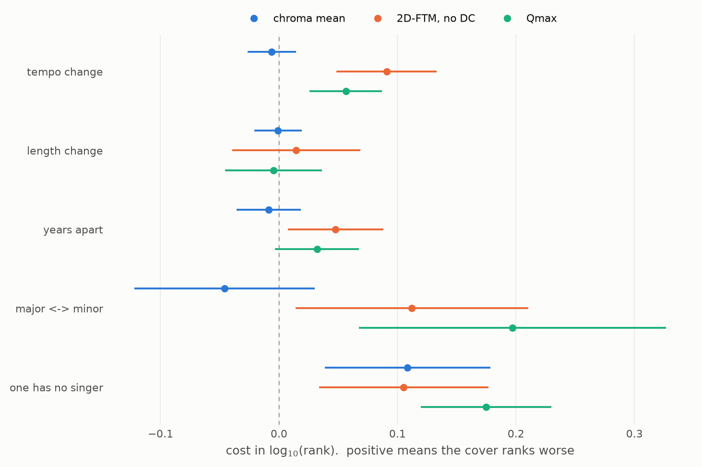

# Finding the same songs from a cover of a song.
This project tries to rank performances of different songs so that an actual cover of a song ranks at the top over other performances.

This is somewhat hard because a cover of a song can differ in key, tempo, and instruments. 

# How do you rank the cover of a song?
What doesn't change in between covers is the harmonic progression.

However comparing he harmonic progressions of songs brings in the same problems of tempo and key:
- keys change the actual chords being played
- tempo changes in what timeframe the chords are played.

A lot of this project is just finding ways to compare chord sequences while ignoring changes to those chord sequences.

# What methods are used to achieve this?
I used four different methods:
- just look at duration
- squish the entire song into one matrix, and then find the 2d fourier transform of it, and then find the magnitude. 
- use the q-max algorithm to align the two song's chord sequences
- learning invariances through a convulution network

# Evaluation Metrics
I used four evaluation metrics for each method:
- average precision measure the precision-at-rank of every position where a correct song was identified. so correct songs in earlier positions have a higher rank than correct songs in later positions. then the MAP (mean average precision) is the average of all the average precisions for each song.
- MR1 (mean rank of first correct hit) measures on average how far down the ranked list a model ranked the first correct hit.
- P@10 (precision at 10) measures out of the first ten rankings, how many are actually correct.

# Data Used
I did not collect all this data, I used the DA-TACOS dataset. Specifically the "Benchmark subset" which includes 15,000-performances. 

This data set includes 1,000 "cliques" which are groups of 13 cover perfoamcnes of the same song. The remaining 2,000 items are cliques with only one performance used as distractors.

For each performance, there is a file containing the chroma for every fraction of a second of a song.

There is a master list that is basically a dictionary for the label of each performance and the file containing the chroma.

# Results

These come from one run at commit `b80b20b` on a Windows machine with 32 GB of RAM
and an RTX 5070 Laptop. Every run writes its own file in `results/`, with the config,
seed and commit that produced it, and `scripts/report.py` collects them.

MAP is only comparable **within one collection**. A method scored on 650 items has
far fewer ways to be wrong than one scored on 15,000, so it scores higher for free.
That is why these are three tables and not one.

The "2D-FTM, no DC" rows are the same 2D Fourier method with one coefficient
removed. That is explained under the tables.

**All 15,000 performances** — 13,000 of them can be queries, since the 2,000
singletons have no correct answer to find.

| method | MAP | MR1 | P@10 | ties | time |
|---|---:|---:|---:|---:|---:|
| 2D-FTM, no DC | 0.0547 | 300.9 | 0.0698 | 0.30% | 7 min |
| 2D-FTM | 0.0368 | 342.6 | 0.0510 | 0.28% | 2 min |
| duration | 0.0024 | 1043.7 | 0.0017 | 48.90% | 1 min |
| random | 0.0014 | 1183.9 | 0.0008 | 0.05% | 1 min |

**Held-out test split** — 4,600 items, 2,600 queries. The only collection the
trained network is allowed to be scored on.

| method | MAP | MR1 | P@10 | ties | time |
|---|---:|---:|---:|---:|---:|
| learned CNN | 0.2882 | 25.6 | 0.3172 | 0.17% | 68 s |
| 2D-FTM, no DC | 0.0901 | 83.0 | 0.1095 | 0.17% | 2 min |
| 2D-FTM | 0.0593 | 97.3 | 0.0773 | 0.16% | 19 s |
| duration | 0.0070 | 317.4 | 0.0046 | 22.96% | 3 s |
| random | 0.0046 | 352.5 | 0.0032 | 0.02% | 4 s |

**50 cliques on their own** — 650 items, no distractors. Q-max is too slow to run
on the full 15,000, so the cheap methods are re-run here to meet it fairly.

| method | MAP | MR1 | P@10 | ties | time |
|---|---:|---:|---:|---:|---:|
| Qmax | 0.5585 | 4.1 | 0.5980 | 34.89% | 47 min |
| 2D-FTM, no DC | 0.2263 | 10.5 | 0.2448 | 0.62% | 17 s |
| 2D-FTM | 0.1781 | 13.5 | 0.2012 | 0.62% | 3 s |
| duration | 0.0489 | 40.5 | 0.0431 | 3.95% | 0 s |
| random | 0.0294 | 46.6 | 0.0237 | 0.00% | 0 s |

The times are wall clock and some runs shared the machine with other work, so treat
them as an upper bound rather than a benchmark.

## Every method against its floor

<picture>
  <source media="(prefers-color-scheme: dark)" srcset="docs/figures/map-by-collection-dark.png">
  
</picture>

One panel per collection, each with its own scale, so the three are not accidentally
compared. Grey bars are the methods that never look at the audio. The dashed line is
the random floor.

Both of the dumb baselines beat random, and `duration` beating random is expected
rather than impressive: covers of a song do tend to run to similar lengths. The give
away is the ties column. On the full collection **48.9%** of neighbouring pairs in
duration's ranking are exact ties, because frame counts collide constantly, so about
half of that ranking is really just index order.

The MAP numbers look low everywhere, and that is the task rather than a bug. A query
on the full collection is hunting 12 correct answers among 14,999. MR1 is the easier
column to feel: the best untrained method puts the first correct cover at rank 301 on
average, and the network puts it at 27.

## How far down the list you have to read

<picture>
  <source media="(prefers-color-scheme: dark)" srcset="docs/figures/rank-curve-dark.png">
  
</picture>

For each rank k, the share of queries that have found a correct cover by then. Q-max
gets one into first place for **86%** of queries, 2D-FTM for 39%, random for 2%.

This is the picture MR1 flattens. 2D-FTM's MR1 of 13.5 on the subsample is not a
typical query at rank 13; it is most queries doing well and a long tail doing badly.

## Why the 2D Fourier method works, and where it stops

<picture>
  <source media="(prefers-color-scheme: dark)" srcset="docs/figures/ftm2d-invariance-dark.png">
  
</picture>

The middle column is the reason the method exists, and it holds exactly: roll the
pitch axis, which is what changing key does, and the magnitude spectrum does not
move at all. The distance is 1e-07, zero as far as floating point is concerned.

The right column is the actual job. A real cover is not a clean transposition of the
query, it is a different performance, so it only lands *close* — rank 110 out of 649.
The gap between those two columns is the whole difficulty of the problem. Both
examples are median cases picked by rank, not flattering ones.

**Deleting one number was the biggest win.** The descriptor's DC coefficient is just
the mean of the chroma patch, and it carries about **97%** of the vector's energy.
With it in, every distance on the subsample lands between 0 and 0.05, so the bins
that actually say which song this is are a rounding error on a bin that says almost
nothing. Zeroing it lifts MAP by **27% / 52% / 49%** relative across the three
collections. It is off by default (`drop_dc`), so the plain 2D-FTM row stays the
method as published and the improvement is a measured comparison rather than a
silent edit.

## What Q-max is actually looking at

<picture>
  <source media="(prefers-color-scheme: dark)" srcset="docs/figures/cross-recurrence-dark.png">
  
</picture>

A dot means two moments of the two songs share a harmony. The threshold fixes how
many dots there are, so an unrelated song is about as dotty as a real cover — 2.3%
against 2.5% — and staring at it does not tell you much. What the alignment measures
is how far a single diagonal runs before it breaks, which here is 0.09 against 0.37.

Keeping time is worth a lot. Q-max reaches **0.5585** MAP where the best descriptor
manages 0.2263 on the same 650 songs. 2D-FTM squashes a whole song into one vector
and can only ask whether two songs have a similar harmonic texture; Q-max keeps the
sequence and asks whether they walk the same path through it. It costs 47 minutes
against 3 seconds, because it is a dynamic program for each of 210,925 pairs.

Its ties column says 35%, which is worth explaining rather than ignoring. The score
is a discrete maximum, so pairs land on the same value: 210,925 pairs take only
37,646 distinct ones. Ties are broken by index order, and this collection is 92%
clique grouped, so index order lines up with the right answer and could be inflating
the score. It is not — re-scoring the same distances under five random shuffles of
the collection moves MAP by 0.0001. The ties sit in the tail, far below the ranks
these metrics are decided at.

## The network

It wins by a wide margin on the only collection it is allowed to be scored on:
**0.2882** against 0.0901 for the best classical method on the same 4,600 items. It
trains on 700 cliques, validates on 100 and tests on 200, split by clique so no song
ever appears on both sides, and the saved checkpoint is the epoch with the best
validation MAP rather than the last one.

That number was 0.2926 until the factor analysis below turned up a bug in how the
embeddings were computed — batching padded the short performances and the pooling
averaged over the padding, so a performance embedded differently depending on which
other tracks shared its batch. Fixing it *lowered* MAP slightly and improved MR1
from 27.1 to 25.6, because the padding had been leaking a length cue into the
embedding, and covers of one work do tend to run to similar lengths. The number
below is smaller and means what it says.


# What breaks retrieval

Everything above asks whether a method beats the floor. This asks **why it fails on
the covers it fails on** — and whether the invariances every method here claims by
construction survive contact with real covers.

Every method above is built to ignore a key change. 2D-FTM gets that from the FFT
magnitude, Q-max by transposing to the OTI first, and the network from convolutions
that wrap around the pitch axis. Those are claims about the code. Until now the only
evidence for any of them was a test that rolls a synthetic array.

So: take each query and each of its true covers, and make one row out of where that
cover landed and what differs between the two performances. On the 50-clique
subsample that is 7,800 rows.

Two things make the answer worth reading rather than merely computed.

**A fixed effect per query.** A query with a muddy chroma ranks all twelve of its
covers badly whatever key they are in, and pooling rows across queries would hand
that difficulty to whichever factor happened to correlate with it. Each query's own
mean is subtracted first, so a coefficient is identified only by comparing one
query's covers against each other: *of these twelve, did the ones further from the
original key land further down?* Everything about the query itself is gone before
the first coefficient is estimated, whether or not I thought to measure it.

**Two controls that differ in one property.** `chroma_mean` and `chroma_mean_oti`
are the same descriptor — the average pitch-class profile of a whole performance —
compared where it lies and compared at its best of twelve rotations. One is key
invariant and the other is not, and they are identical otherwise. Without them,
"key shift does not predict rank" is indistinguishable from an analysis too weak to
detect anything at all.

## The key invariance is real. Transposed covers still rank worse.

<picture>
  <source media="(prefers-color-scheme: dark)" srcset="docs/figures/key-invariance-dark.png">
  
</picture>

| method | observed key effect | MAP lost when re-keyed | MAP |
|---|---:|---:|---:|
| chroma mean | +1.0692 | 52.8% | 0.0959 |
| 2D-FTM, no DC | +0.1345 | 0.0% | 0.2263 |
| chroma mean, best key | +0.1284 | 0.0% | 0.1129 |
| Q-max | +0.1275 | 0.0% | 0.5585 |
| 2D-FTM | +0.1031 | 0.0% | 0.1781 |
| duration | +0.0058 | 0.0% | 0.0489 |
| random | −0.0057 | 0.0% | 0.0294 |

The first column is the cost in log₁₀(rank) of a cover being in another key,
averaged over the six shift sizes, from the covers that happen to be transposed.
The second re-keys **every performance by its own random amount** and re-runs the
whole thing. That changes each recording's key and nothing else — same arrangement,
same tempo, same length — so a method whose invariance is real must return an
identical ranking.

The two columns disagree, and the disagreement is the finding.

2D-FTM does not lose 0.0% in the sense of rounding to it. Its MAP after re-keying is
**bit-identical** — a delta of exactly `0.00e+00` — and so is Q-max's to within
`1.9e-06`, which is its per-pair transposition search occasionally breaking a tie
the other way. The invariance is not approximately real, it is arithmetic. And the
sensitive control losing half its MAP on the very same test proves the measurement
can see a key effect when there is one.

Yet covers that *happen* to be in another key still rank about 35% further down for
both — 10^0.1345.

Both things are true because a key change does not cost these methods anything — it
marks a cover that was reinterpreted more freely in every other way too, including
ways nobody measured. A singer who moves a song into their own range is usually
rebuilding the arrangement while they are at it. No regression can control for a
variable that was never recorded, which is why the intervention is here: it is the
only column that answers a causal question.

Reporting only the regression would have said 2D-FTM is not really key invariant.
That is false, and the figure on the right is why.

I chased the confound the other way first. Restricting to pairs whose Essentia key
label agrees with the transposition measured from the chroma makes the effect
**larger**, not smaller — 0.1345 to 0.2156 for 2D-FTM — which is what attenuation
from a noisy regressor looks like in reverse. The observational effect is real. It
is just not caused by the key. Worth knowing while reading that column: the key
label and the chroma agree on only **55%** of pairs, and Essentia puts 20% of the
collection in C.

## Everything else that predicts a bad rank

<picture>
  <source media="(prefers-color-scheme: dark)" srcset="docs/figures/effect-sizes-dark.png">
  
</picture>

Cost in log₁₀(rank); `*` marks an interval excluding zero. Tempo, length and years
are per standard deviation, the other two are the whole switch.

| method | tempo | length | years apart | major↔minor | one has no singer |
|---|---:|---:|---:|---:|---:|
| chroma mean | −0.006 | −0.001 | −0.009 | −0.046 | +0.109\* |
| chroma mean, best key | +0.008 | −0.003 | +0.018 | +0.181\* | +0.163\* |
| 2D-FTM | +0.047\* | +0.010 | +0.039\* | +0.085 | +0.272\* |
| 2D-FTM, no DC | +0.091\* | +0.015 | +0.048\* | +0.112\* | +0.105\* |
| Q-max | +0.057\* | −0.005 | +0.032 | +0.197\* | +0.175\* |
| duration | +0.004 | **+0.407\*** | −0.003 | +0.016 | +0.005 |
| random | +0.002 | −0.017 | −0.006 | −0.006 | −0.011 |

Every row of that table says something the method's design predicts, which is the
main reason to believe the rest of it.

**Tempo behaves exactly as each method's construction says it should.** The two
`chroma mean` rows are flat, because an average pitch-class profile has no time axis
at all and there is nothing for a tempo change to disturb. 2D-FTM has the largest
penalty of any real method, because its patch is a fixed 180 frames and a faster
performance simply does not line up with it. Q-max sits between them, because its
alignment warps locally and absorbs some of the stretch. This is the one place where
a genuine weakness shows up, and it shows up where the code says it would.

**Only the `duration` method cares about length**, at +0.407 — the largest single
number in the table, from the one method that ranks by nothing else. Every real
method is flat there. So arrangement length is not what hurts them; the local time
scale is, and the two factors are doing separate jobs.

**Changing the mode or dropping the vocal costs real money**, and costs Q-max most.
That fits: it is the method that insists on matching an actual sequence of harmonies,
so rewriting them hurts it more than it hurts a method comparing bulk texture.

`random` is flat everywhere, which is the null control this table needs to be worth
reading at all. It earned its keep twice. `same_artist` — whether both recordings
are by the same performer — showed up as a *significant* predictor of a ranking made
of pure noise, which is impossible. It is true for **2 of 30,648 pairs** on the test
split, all inside one clique, and a standard error clustered on cliques cannot be
asked for more than one clique's worth of evidence. Factors that vary across fewer
than five cliques are now dropped and listed rather than reported.

## The network, and the bug this analysis found

The learned CNN is the only method scored on the held-out split, so it gets its own
run of the same machinery. Two things came out of it.

**It is the only method whose key effect is null observationally as well as
interventionally.** All six of its key-shift coefficients have intervals covering
zero (p between 0.07 and 0.51), where 2D-FTM's are firmly positive. It is also by
far the most accurate method on that split. Both fit the same explanation: the
observational key effect is really a proxy for *how badly a method handles a freely
reinterpreted cover*, and the network handles those best, so the proxy has least to
bite on.

**Its length coefficient was an artifact, and finding that fixed a real bug.** The
first run gave the CNN a `duration_ratio` coefficient of **+0.278** — nothing like
the ~0.01 of every other real method, and second only to the `duration` baseline
itself. A method whose embedding is supposed to describe harmony should not care
that much about length.

It didn't. `embed` pads a batch to its longest member and the network mean-pools over
time, padding included, so an embedding depended on which other tracks shared its
batch. The same performance embedded alone and beside a longer one had a cosine
similarity of **0.68** with itself. Zeros are not neutral: batch norm shifts them,
the ReLU keeps what survives, and it leaks back through the convolutions into the
last real column.

Masking both pools and grouping batches by padded width fixed it — same performance,
any batch, now agrees to 3e-05, which is float32 kernel choice rather than structure.
The coefficient fell from **+0.278 to +0.083**, and `year_gap` fell with it, since
length had been standing in for era. `test_models.py` now asserts the property.

This is the argument for the whole milestone in one example. The bug was invisible to
MAP — it *raised* MAP, by smuggling in a length cue that correlates with the right
answer — and only showed up as a coefficient that made no sense for the architecture.

## What Da-TACOS cannot answer

Two factors are missing from all of that because the dataset does not support them,
and guessing at them would have been worse than leaving them out.

**Live versus studio.** Only 2 of 40,890 MusicBrainz recording entries carry a
`live` tag. Performance titles are clean work titles rather than release variants:
a regex across all 15,000 returns 59 hits and every one is a false positive, along
the lines of *I Live for Your Love*. There is no signal to recover.

**Genre.** Reachable only as Last.fm tags on about 13% of performances, and those
attach to a *candidate* MusicBrainz recording rather than to the performance whose
audio was actually analysed. Too sparse and too indirect to condition on.

Tempo very nearly joined them. Da-TACOS ships madmom's beat tracking, but the local
archive is a truncated 19 MB fragment of a 3.8 GB file, so the `tempo` column here
is estimated from the chroma instead: the flux of the chroma is a novelty curve and
its dominant periodicity is a pulse. That measures harmonic rhythm rather than the
beat, which is fine for the only use it gets — a *ratio* between two performances of
one work, who are playing the same chord sequence.

## Does it replicate?

Everything above is the 50-clique subsample, chosen because it holds Q-max and has
the highest MAPs, so a null there is least likely to be a power failure. The same
analysis over the **full 15,000 performances — 156,000 pairs in 1,000 cliques** —
gives the same answers with twenty times the cliques:

| method | key | tempo | length | major↔minor | no singer |
|---|---:|---:|---:|---:|---:|
| chroma mean | **+1.183** | +0.007\* | +0.007\* | −0.001 | +0.071\* |
| chroma mean, best key | +0.093 | +0.025\* | +0.015\* | +0.240\* | +0.131\* |
| 2D-FTM | +0.069 | +0.078\* | +0.008 | +0.073\* | +0.282\* |
| 2D-FTM, no DC | +0.106 | +0.119\* | +0.019\* | +0.104\* | +0.083\* |
| duration | +0.009 | +0.003\* | **+0.404\*** | +0.006 | −0.012\* |
| random | −0.001 | −0.002 | −0.001 | +0.001 | −0.001 |

The tempo ordering survives exactly — flat for a descriptor with no time axis, worst
for the fixed-patch method, in between for the one that warps. `duration` lands at
+0.404 against +0.407 on the subsample and +0.405 on the test split, which is a
reassuring amount of agreement for three different collections. And `random` is null
on all five factors at the largest sample size available, which is the strongest form
of the only control that can say this machinery is not manufacturing effects.

One thing 1,000 cliques changes is worth naming: at this size almost anything is
statistically significant. `chroma mean`'s tempo coefficient is starred at +0.007,
and it is still nothing — a descriptor with no time axis has no mechanism for a tempo
effect, and 0.007 in log₁₀(rank) is under 2% of a rank. Read the sizes, not the stars.

## How much to trust the intervals

Standard errors are clustered on the **clique**, not the query. Thirteen
performances of one work succeed and fail together, every unordered pair appears
twice (once in each direction), and both directions live in the same clique.
Treating 7,800 rows as 7,800 independent observations would shrink every interval by
roughly the square root of thirteen and turn ordinary between-work variation into
significance.

Three caveats worth stating rather than burying:

- The subsample has **50 cliques**, which is 50 independent pieces of evidence
  however many pairs they contain. That is on the low side for a cluster-robust
  sandwich.
- This is inference about the *query sample* given a fixed collection. The 2,000
  distractors never move. It says how much a number would wobble if the works had
  been drawn differently, not how it would move on another dataset.
- Q-max ties 35% of adjacent pairs, and the collection is clique-contiguous, so its
  tie-breaking is correlated with the right answer.

# Dependencies Needed
- Numpy, scipy for all the array math, fast fourier transform, signal processing
- h5py reads Da-TACOS performance files in .h5 format
- pandas for joining data
- pytest for testing
  


## Layout

```
src/csr/
  data/      datacos.py  loading and the manifest
             splits.py   clique-level splits and subsamples
             cache.py    downsampled chroma, stored once
             synthetic.py generated corpus for tests
  features/  chroma.py   normalise, downsample, transpose, OTI
             ftm2d.py    the 2D Fourier magnitude descriptor
  similarity/vector.py   chunked cosine distance
             qmax.py     recurrence plots and the alignment DP
  eval/      metrics.py  MAP / MR1 / P@10, and the per-pair layer under them
             batch.py    the same thing, a block of queries at a time
  analysis/  tempo.py    pulse from chroma flux, since madmom's is unreadable
             factors.py  what changed between a query and one of its covers
             stats.py    bootstrap over cliques, not queries
             regress.py  within-query fixed effects, clustered errors
  methods.py the registry: every method returns a distance matrix
  models.py  the learned embedding
  run.py     config -> method -> results/<name>.json
```
